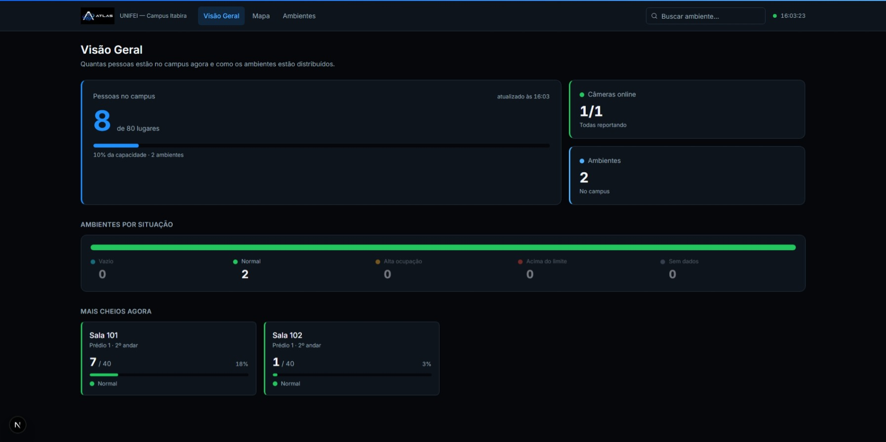
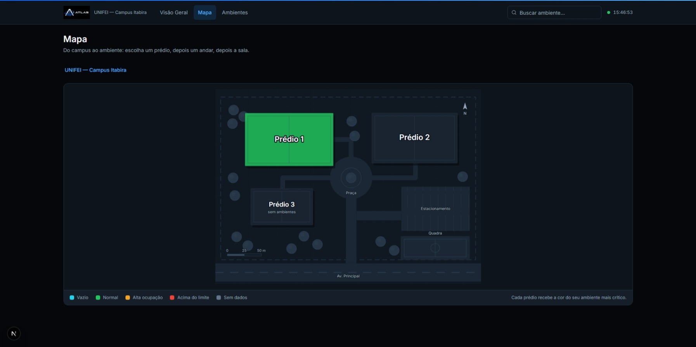
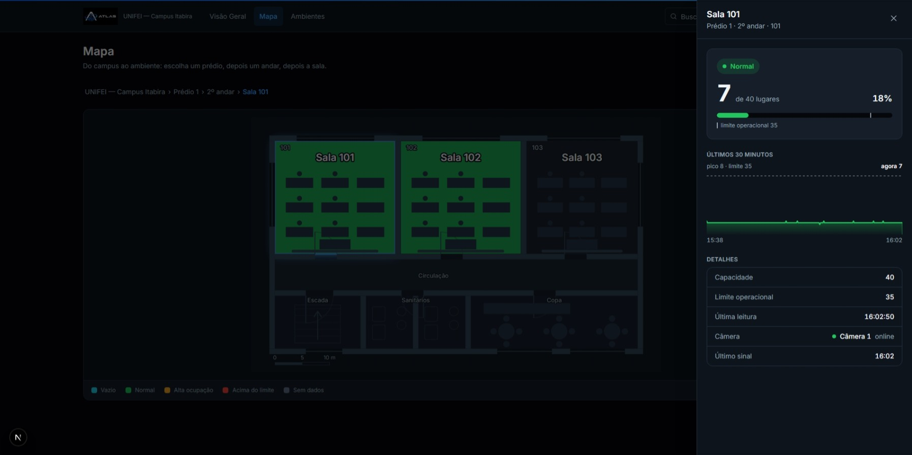

# ATLAS

**A**mbiente **T**ecnológico para **L**ogística e **A**nálise **S**istêmica — uma
camada operacional única para o campus universitário.

Este repositório é o MVP, que responde a uma pergunta só:

> "Quantas pessoas estão em cada ambiente da universidade **agora**?"

A resposta vem de uma câmera comum: o vídeo vira detecção, a detecção vira
contagem por ambiente, e a contagem vira um mapa que alguém olha antes de
decidir para onde ir.



## Como funciona

Três módulos independentes, conectados por um contrato HTTP e por um arquivo de
configuração compartilhado:

```
   câmera / vídeo
         │
         ▼
  ┌─────────────┐   POST /ingest    ┌─────────────┐   GET /spaces    ┌─────────────┐
  │   vision/   │ ────────────────▶ │    api/     │ ◀─────────────── │  website/   │
  │ YOLO + ROIs │  a cada ~5 s      │  FastAPI    │  polling de 2 s  │  Next.js    │
  └─────────────┘                   └─────────────┘                  └─────────────┘
         │                                 │
         └──────── api/seed.json ──────────┘
              (estrutura do campus + ROIs)
```

**A visão** abre o vídeo, detecta apenas pessoas com YOLO, decide em qual região
(ROI) cada pessoa está pelo ponto dos pés, suaviza a contagem com uma mediana
deslizante e envia um `POST /ingest` por câmera.


**A API** grava cada contagem como um snapshot e calcula o status **na leitura**,
nunca na gravação. A razão é direta: um status gravado no ingest jamais viraria
`no_data`, porque `no_data` significa exatamente que o ingest parou de chegar.

| Status | Quando | Cor |
|---|---|---|
| `no_data` | a câmera está em silêncio há mais de 30 s, ou a ROI foi desabilitada | cinza |
| `empty` | nenhuma pessoa detectada | azul |
| `normal` | abaixo de 70 % do limite do ambiente | verde |
| `high` | entre 70 % e o limite | amarelo |
| `over_limit` | acima do limite | vermelho |

O limite é o `operational_limit` do ambiente; na falta dele, a `capacity`. Em
`no_data` a API devolve `person_count` e `occupancy_rate` como `null` e mantém o
`captured_at`: o dado some, o silêncio fica datado.

**O site** consome só os `GET` do contrato e nunca recalcula status — traduz o
código que vem da API em rótulo e cor. Se a API cair, a última tela continua no
lugar, um aviso aparece no topo e o polling segue tentando.

**`api/seed.json`** é a fonte única da estrutura da demo: a API popula o banco a
partir dele e a visão lê dele as câmeras e as ROIs. Não existe endpoint de
configuração de ROI — mudar o campus é editar esse arquivo. Seed inválido
derruba a API de propósito, porque subir com a estrutura pela metade esconderia
o erro até a hora da demo.

| Rota | O quê |
|---|---|
| `GET /health` | `{"status": "ok"}` |
| `GET /structure` | campus → prédios → andares → ambientes |
| `GET /spaces` | todos os ambientes com a ocupação atual |
| `GET /spaces/{id}` | idem, mais a câmera/ROI de origem |
| `GET /spaces/{id}/history?minutes=30` | série temporal, até 500 pontos |
| `GET /summary` | agregados do campus |
| `POST /ingest` | usado **somente** pelo módulo de visão |

## Os três módulos

| Pasta | O quê | Stack | Porta | Detalhes |
|---|---|---|---|---|
| `api/` | backend e banco | Python · FastAPI · SQLAlchemy · SQLite | 8000 | [README](api/README.md) |
| `vision/` | detecção e contagem | Python · OpenCV · Ultralytics YOLO | — | [README](vision/README.md) |
| `website/` | interface web | Next.js · React · TypeScript | 3000 | [README](website/README.md) |

Cada módulo roda sozinho: a API sobe sem a visão (os ambientes ficam em
`no_data`), o site sobe sem a API (modo mock) e a visão sobe sem vídeo e sem
modelo (modo fake).

## Requisitos

- **Python 3.10 ou superior** — para a API e para a visão.
- **Node.js 20.9 ou superior** e **npm** — para o site.
- **Git**.
- Windows, se quiser usar o `atlas.bat`. Em Linux e macOS, a inicialização
  manual abaixo funciona igual.

O modelo YOLO (`yolo11n.pt`, ~6 MB) é baixado pela Ultralytics na primeira
execução real da visão — essa primeira vez precisa de internet.

## Instalação

Cada módulo Python tem o próprio ambiente virtual. O `atlas.bat` usa o `.venv`
de cada pasta quando ele existe e cai no Python do sistema quando não existe.

```bash
git clone <url-do-repositorio>
cd ATLAS
```

**API:**

```bash
cd api
python -m venv .venv
.venv\Scripts\activate           # Windows;  Linux/macOS: source .venv/bin/activate
pip install -r requirements.txt
cd ..
```

**Visão:**

```bash
cd vision
python -m venv .venv
.venv\Scripts\activate           # Windows;  Linux/macOS: source .venv/bin/activate
pip install -r requirements.txt
cd ..
```

**Site:**

```bash
cd website
npm install
cd ..
```

Nenhum dos três precisa de configuração para rodar: os padrões já apontam para
`localhost:8000` e `localhost:3000`, e o banco é criado e populado na primeira
subida da API.

## Como iniciar

### Windows, em um comando

```batch
atlas.bat
```

Sobe os três módulos, cada um na sua janela, na ordem certa: confere se as
portas estão livres, sobe a API, **espera o `/health` responder** e só então abre
o site e a visão. Depois é só abrir <http://localhost:3000>. Fechar as três
janelas encerra tudo.

```batch
atlas.bat fake
```

Mesma coisa, mas com a visão em modo fake: contagens sintéticas, sem vídeo e sem
YOLO. É o plano B para demonstrar o sistema em uma máquina sem câmera, sem GPU
ou sem internet.

As portas e a câmera saem do ambiente:

```batch
set API_PORT=8001 && set WEB_PORT=3001 && set CAMERA_ID=CAM-02 && atlas.bat
```

### Manualmente, em três terminais

Necessário em Linux e macOS, e útil para acompanhar o log de um módulo isolado.

```bash
# Terminal 1 — API
cd api
uvicorn app.main:app --reload --port 8000
```

```bash
# Terminal 2 — site
cd website
npm run dev
```

```bash
# Terminal 3 — visão (espere a API responder antes)
cd vision
python run.py --seed ../api/seed.json --camera-id CAM-01 --api-url http://localhost:8000
```

Acrescente `--fake` no terceiro para o modo sem vídeo, ou `--source 0` para usar
a webcam no lugar do vídeo de demonstração. A tecla `q` na janela da visão
encerra o processo.

Com tudo no ar:

| Endereço | O quê |
|---|---|
| <http://localhost:3000> | o site |
| <http://localhost:8000/docs> | documentação interativa da API |
| <http://localhost:8000/health> | teste rápido de que a API está viva |

### Sem backend nenhum

O site tem um modo mock com nove ambientes, as cinco situações de status e uma
câmera offline. Em `website/.env.local`:

```
NEXT_PUBLIC_USE_MOCK=true
```

## Configuração

Todas as variáveis são opcionais; os valores abaixo são os padrões.

**API** (`api/.env`, modelo em `api/.env.example`) — caminhos relativos são
resolvidos a partir de `api/`, não do diretório atual:

| Variável | Padrão | O quê |
|---|---|---|
| `ATLAS_DB_PATH` | `atlas.db` | arquivo SQLite |
| `ATLAS_SEED_PATH` | `seed.json` | seed lido pela API **e** pela visão |
| `ATLAS_CORS_ORIGINS` | `http://localhost:3000` | origens liberadas, separadas por vírgula |
| `ATLAS_NO_DATA_SECONDS` | `30` | silêncio da câmera que derruba o ambiente para `no_data` |

**Site** (`website/.env.local`, lido em tempo de build):

| Variável | Padrão | O quê |
|---|---|---|
| `NEXT_PUBLIC_API_URL` | `http://localhost:8000` | base da API |
| `NEXT_PUBLIC_USE_MOCK` | `false` | `true` lê os JSON de `lib/mock/` no lugar da API |

**Visão** (argumentos de linha de comando):

| Argumento | Padrão | O quê |
|---|---|---|
| `--seed` | `../api/seed.json` | de onde vêm câmera e ROIs |
| `--camera-id` | `CAM-01` | qual câmera do seed processar |
| `--api-url` | `http://localhost:8000` | para onde mandar o `/ingest` |
| `--source` | do seed | arquivo, índice de webcam ou URL de stream |
| `--process-fps` | `3.0` | quadros analisados por segundo |
| `--window` | `7.0` | janela da mediana, em segundos |
| `--send-interval` | `5.0` | intervalo entre ingests, em segundos |
| `--model` | `yolo11n.pt` | peso do modelo |
| `--conf` | `0.4` | limiar de confiança da detecção |
| `--no-window` | — | roda sem a janela do OpenCV |
| `--fake` | — | contagens sintéticas, sem vídeo e sem modelo |

Mudar `.env` ou `.env.local` exige reiniciar o processo correspondente.

## Testes

```bash
cd api
pip install -r requirements-dev.txt
python -m pytest
```

```bash
cd vision
python -m pytest tests -q          # ou: make test
```

Há ainda um smoke test ponta a ponta da visão contra uma API de mentira
(`vision/tools/mock_api.py`) e um `vision/evaluate.py`, que mede o erro médio da
contagem contra frames anotados à mão. Os dois estão descritos no
[README da visão](vision/README.md).

## Estrutura do repositório

```
api/                 backend FastAPI + SQLite
  seed.json          estrutura do campus e ROIs (fonte única)
  app/               aplicação
  tests/             um teste por item do Definition of Done
vision/              agente de visão computacional
  run.py             ponto de entrada
  atlas_vision/      detecção, ROIs, suavização, cliente de ingest
  evaluate.py        medição de precisão contra anotação manual
  tools/mock_api.py  API de mentira para smoke test
website/             interface Next.js
  app/               as três telas
  lib/api.ts         único ponto de contato com o backend
  lib/mock/          modo mock, no formato exato do contrato
atlas.bat            sobe os três módulos de uma vez (Windows)
```

## As telas

| Rota | Tela |
|---|---|
| `/` | Visão Geral: pessoas no campus, ambientes por situação, mais cheios agora |
| `/mapa` | Mapa: campus → prédio → andar → ambiente |
| `/ambientes` | Tabela com todos os ambientes, com busca |

<p align="center">
  
  
</p>

Cada prédio no mapa recebe a cor do seu ambiente mais crítico. Cor nunca é a
única informação: todo indicador vem acompanhado de rótulo em texto.

## Convenções

- Identificadores em inglês; comentários, textos de tela e documentação em
  português.
- Comentário explica o **porquê** de uma decisão não-óbvia, nunca o que o código
  já diz.
- O status vem pronto da API; nenhum outro módulo recalcula faixa ou status.
- No site, cor só sai de token CSS — nenhum hex fora de `app/globals.css`.

## LGPD

A visão detecta **pessoas**, não identidades: só a classe `person` do YOLO, sem
reconhecimento facial e sem tracking entre quadros. Nenhum frame é gravado ou
transmitido; o que sai da câmera é uma contagem inteira por região. O banco
guarda números e horários, nunca imagens.

## Fora do escopo do MVP

Autenticação, permissões, WebSocket, eventos, reconhecimento facial, filas,
microserviços, cloud, endpoint de configuração de ROI e streaming de vídeo.

O MVP não existe para ser a plataforma completa — existe para provar que a
arquitetura funciona de ponta a ponta.
